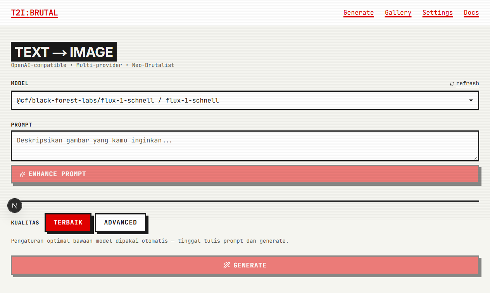
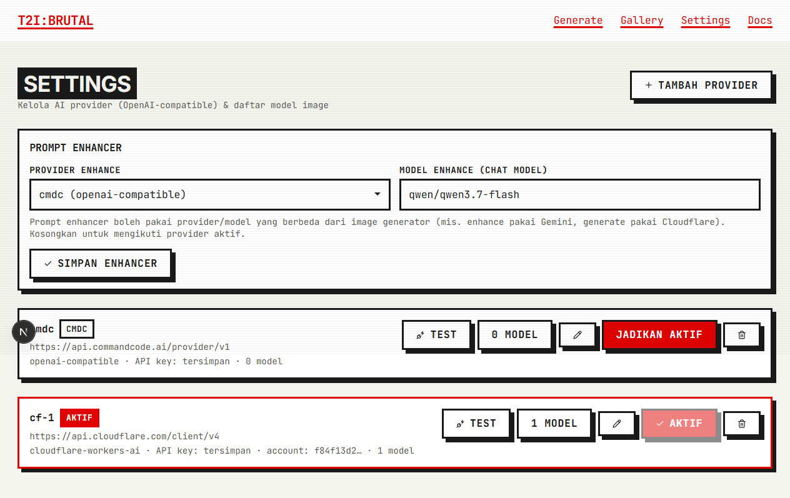

# ImageGen — Multi-Provider Text-to-Image

   

A Neo-Brutalist text-to-image web app that works with **any AI provider**. Plug in an OpenAI-compatible gateway, **Google Gemini (Nano Banana)**, or **Cloudflare Workers AI** — providers and image models are configured entirely from the UI, no code changes needed.

> All AI calls go through a small **adapter layer** on the server. Supporting a new provider = implementing one interface.

## Screenshots

| Generate | Settings |
| --- | --- |
|  |  |

## Features

- **Multi-provider by design** — OpenAI-compatible gateways, Google Gemini, and Cloudflare Workers AI out of the box; providers are swappable at runtime from `/settings`
- **UI-managed configuration** — add/edit/remove providers, API keys, and image models without touching code (stored server-side in `data/providers.json`, git-ignored)
- **Separate prompt-enhancer target** — enhance prompts with a chat model from a different provider than the image generator (e.g. enhance with Gemini, draw with Cloudflare)
- **Terbaik / Advanced quality modes** — zero-config generation, or full control over image size, batch, steps, CFG, seed, and negative prompt
- **Connection testing** — one-click "test connection" per provider before saving
- **Per-model parameter translation** — the Cloudflare adapter adapts to each model's strict input schema automatically (e.g. FLUX rejects `width`/`guidance`; SDXL accepts them)
- **Local gallery** — IndexedDB-based gallery with search, re-run, and delete; saved entirely in the browser
- **Built-in docs** — `/docs` walks new users from an empty provider list to their first image

## Supported providers

| Protocol | What you need | Notes |
| --- | --- | --- |
| OpenAI-compatible | Base URL + API key | 24router, OpenRouter, vLLM, Agnes AI, etc. |
| Google Gemini | API key only | Image models require billing; chat models work on the free tier |
| Cloudflare Workers AI | Account ID + API token | Uses the official `api.cloudflare.com/client/v4` endpoint |

## How it works

```
UI (React)                     Next.js server                     AI providers
──────────                     ──────────────                     ────────────
Generator ──► /api/generate ──► providers store ──► adapter ────►  any OpenAI-compatible
Settings ───► /api/providers   (data/providers.    ├─ openai  ──►  https://...
PromptEnh ──► /api/enhance      json, git-ignored) ├─ gemini  ──►  generativelanguage
                                                   └─ cloudflare ►  api.cloudflare.com
```

- The **active provider** serves image generation (`/v1/images/generations` or the provider's native dialect, translated by its adapter).
- A **separately configured enhance provider** serves prompt enhancement (OpenAI chat, Gemini `generateContent`, or Cloudflare `ai/run`).
- Adding a new protocol = dropping one file in `src/lib/providers/` and registering it in the adapter registry.

## Getting started

```bash
npm install --include=dev
npm run dev
```

Open `http://localhost:3000/docs` — the built-in guide walks through adding a provider, models, and your first generation.

### Docker

```bash
docker build -t imagegen .
docker run -p 3000:3000 -v imagegen-data:/app/data imagegen
```

> Mount `/app/data` as a volume — that's where provider configs and API keys live.

> **Note:** configuration is file-based on purpose, so this app targets self-hosted environments (VPS, Docker, home server). Serverless platforms with read-only filesystems (Vercel, Netlify) won't persist `/settings` changes.

## Security

- API keys are stored **only** on the server in `data/providers.json` (git-ignored) and never exposed to the browser — the UI only ever sees a masked "has key" flag.
- All upstream calls happen server-side through the adapter; the client talks exclusively to this app's own API routes.
- `T2I_API_KEY` in `.env` is an optional fallback for providers without their own key.

## Project structure

```
src/
├── app/
│   ├── api/generate/          # image generation via the active provider
│   ├── api/enhance/           # prompt enhancement via the enhance provider
│   ├── api/providers/         # CRUD + connection test + enhance config
│   ├── settings/, docs/       # provider management UI + user guide
│   └── gallery/               # saved images (IndexedDB)
├── components/                # Neo-Brutalist UI components
├── hooks/                     # useModels, useGeneration, useGallery
└── lib/providers/             # ★ adapter layer
    ├── adapter.ts             # ImageProviderAdapter interface + registry
    ├── openaiCompatible.ts    # any OpenAI-compatible gateway
    ├── gemini.ts              # Google Gemini (Nano Banana)
    ├── cloudflare.ts          # Cloudflare Workers AI
    └── store.ts               # data/providers.json persistence
```

## License

[MIT](LICENSE)
